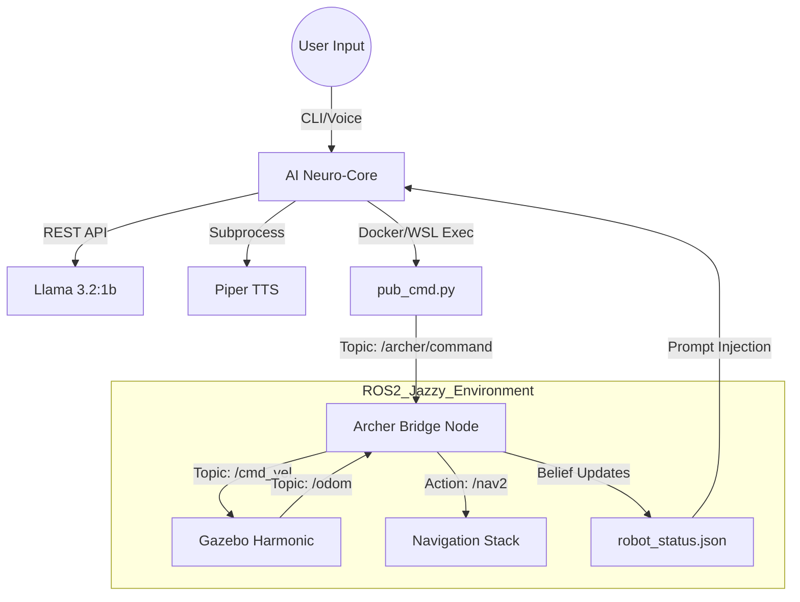

# ARCHER: Advanced Relationship & Command Handling Entity
## Integrated ROS2 System Specification (v2.0 - Jazzy Refactor)

Archer is a fully local, high-performance robotic AI assistant designed for humanoid simulation, autonomous navigation, and conversational control.

---

## 1. System Architecture
The system follows a decoupled "Brain-to-Body" architecture, bridging a high-level Python AI Core on Windows with a modern ROS2 Jazzy Robotics Stack in WSL2/Docker.



---

## 2. Core AI Specifications
The AI layer runs on the Windows host to ensure direct access to microphone and speakers.

| Subsystem | Component | Detail |
| :--- | :--- | :--- |
| **LLM (Brain)** | Ollama | Model: `llama3.2:1b` (optimized for local latency) |
| **STT (Ears)** | Whisper | Model: `base` (openai-whisper) |
| **TTS (Voice)** | Piper | Engine: ONNX Neural Voice (`en_US-lessac-medium`) |
| **Parser** | Custom Regex | Structured JSON intent extraction with safety clamping |
| **Persona** | Archer | Dry, precise, Stark Industries "Friday" persona |

---

## 3. Robotics & Simulation (WSL2/Docker)
The robotics layer is containerized in **Ubuntu 24.04 (Jazzy)**.

*   **Middleware**: ROS2 Jazzy Jalisco
*   **Simulator**: Gazebo Harmonic (GZ Sim)
*   **Robot Model**: Archer Humanoid V2 (Modular Xacro)
*   **Slam**: `slam_toolbox` (Online Asynchronous)
*   **Navigation**: `nav2_bringup` / Navigation2 Stack

### Hardware Simulation Specs
*   **Sensors**: GPU-accelerated Lidar, IMU, Head Camera
*   **Structure**: 8-DOF Humanoid (Pelvis, Trunk, Head, 2x Leg)
*   **Odometry**: GZ Sim Odometry Publisher (EKF Fusion)

---

## 4. Networking & Topic Manifest
Standardized communication channels using `ros_gz_bridge`.

| Topic / Action | Type | Direction | Purpose |
| :--- | :--- | :--- | :--- |
| `/archer/command` | `std_msgs/String` | AI -> Bridge | JSON command packets |
| `/cmd_vel` | `geometry_msgs/Twist` | Bridge -> Sim | Raw velocity control |
| `/goal_pose` | `geometry_msgs/PoseStamped`| Bridge -> Nav2 | Target navigation goals |
| `/odom` | `nav_msgs/Odometry` | Sim -> Bridge | Position data for status |
| `/scan` | `sensor_msgs/LaserScan` | Sim -> Nav2 | Obstacle detection |
| `/tf` | `tf2_msgs/TFMessage` | Sim -> ROS | Coordinate transforms |

---

## 5. Location Semantic Map
Archer uses a real-to-virtual coordinate mapping for semantic awareness.

| Friendly Name | Coordinates [X, Y, Z] | Type |
| :--- | :--- | :--- |
| **origin** | `[0.0, 0.0, 0.0]` | Spawn Point |
| **kitchen** | `[2.0, 3.5, 0.0]` | Goal Node |
| **living_room** | `[-2.0, 2.0, 0.0]` | Goal Node |
| **bedroom** | `[1.5, -1.5, 0.0]` | Goal Node |

---

## 6. Directory Structure
```text
archer_ros/
├── ai/                # LLM, STT, and TTS engines
├── core/              # Main control loop and orchestration
├── config/            # Settings and personality definitions
├── docker/            # Dockerfiles and Jazzy orchestration
├── ros2_ws/           # ROS2 Jazzy Workspace (archer_description)
├── simulation/        # Launch files and Gazebo Harmonic worlds
└── ARCHER_SYSTEM_SPEC.md (This File)
```

---

## 7. Operational Modes
1.  **Direct Mode**: "Move forward" -> Immediate velocity burst.
2.  **Autonomous Mode**: "Go to the kitchen" -> Pathfinding with Nav2.
3.  **Exploration Mode**: "Explore the area" -> Mapping via Slam Toolbox.

---
**Prepared by**: Antigravity Assistant
**Status**: Integrated & Stabilized (Jazzy Refactor)
**Date**: May 10, 2026
