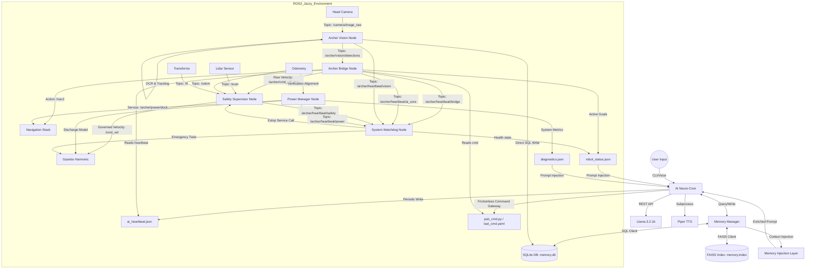
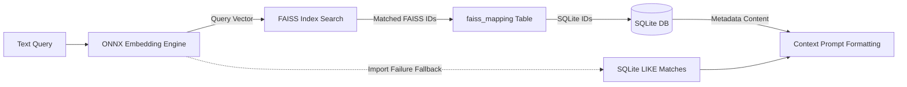
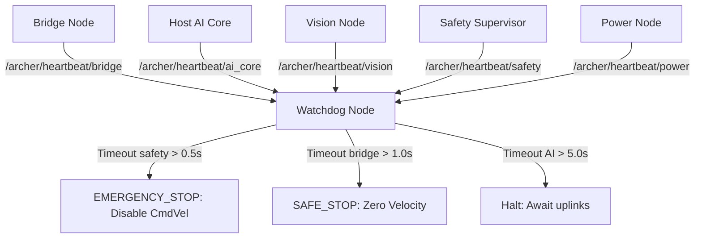
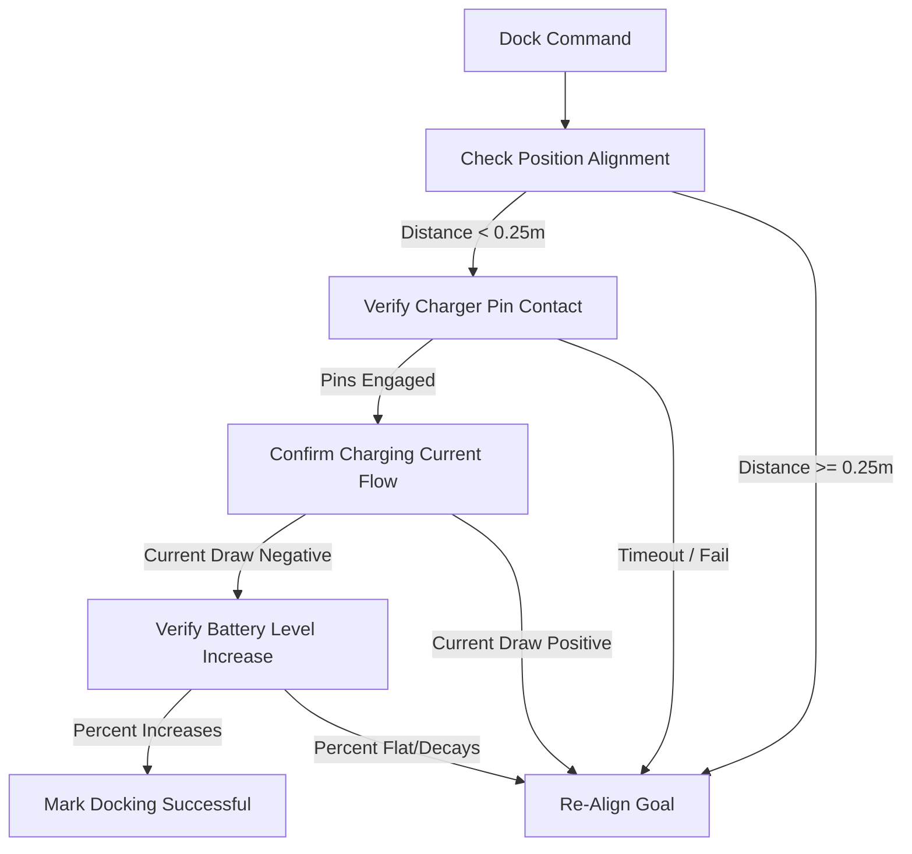
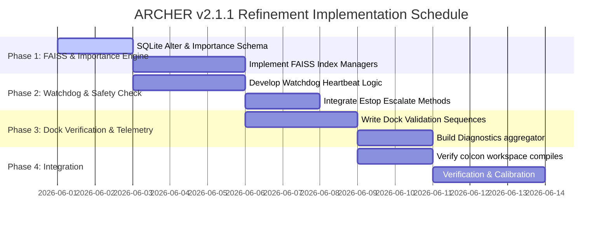

# ARCHER: Advanced Relationship & Command Handling Entity
## Integrated ROS2 System Specification (v2.1.1 - Refinement Update)

Archer is a fully local, high-performance robotic AI assistant designed for humanoid simulation, autonomous navigation, conversational control, vision processing, long-term memory retrieval, safety-critical supervisors, and intelligent power management.

---

## 1. System Architecture
The system follows a decoupled "Brain-to-Body" architecture, bridging a high-level Python AI Core on the Windows host with a containerized ROS2 Jazzy Robotics Stack in WSL2/Docker.



---

## 2. Core AI Specifications
The AI layer runs on the Windows host to ensure direct access to microphone, speakers, and local model servers.

| Subsystem | Component | Detail |
| :--- | :--- | :--- |
| **LLM (Brain)** | Ollama | Model: `llama3.2:1b` (optimized for local latency) |
| **STT (Ears)** | Whisper | Model: `base` (openai-whisper) |
| **TTS (Voice)** | Piper | Engine: ONNX Neural Voice (`en_US-lessac-medium`) |
| **Parser** | Custom Regex | Structured JSON intent extraction with safety clamping |
| **Memory Manager** | SQLite + FAISS | Local persistent memory database combined with FAISS dense indexing |
| **Embedding Engine** | Local ONNX | Sentence-transformer (`all-MiniLM-L6-v2`) for query vectorization |
| **Persona** | Archer | Dry, precise, Stark Industries "Friday" persona |

---

## 3. Robotics & Simulation (WSL2/Docker)
The robotics layer is containerized in **Ubuntu 24.04 (Jazzy)**.

*   **Middleware**: ROS2 Jazzy Jalisco
*   **Simulator**: Gazebo Harmonic (GZ Sim)
*   **Robot Model**: Archer Humanoid V2 (Modular Xacro)
*   **Slam**: `slam_toolbox` (Online Asynchronous)
*   **Navigation**: `nav2_bringup` / Navigation2 Stack
*   **Safety Supervisor**: Standalone C++ node implementing real-time obstacle avoidance and sensor validation.
*   **System Watchdog**: Active heartbeat supervisor enforcing emergency stop triggers.
*   **Vision Subsystem**: ONNX Runtime-powered YOLOv8 node running on the camera stream.

---

## 4. Networking & Topic Manifest
Standardized communication channels using `ros_gz_bridge`.

| Topic / Action / Service | Type | Direction | Purpose |
| :--- | :--- | :--- | :--- |
| `/archer/command` | `std_msgs/String` | AI -> Bridge | JSON command packets |
| `/archer/cmd_vel_raw` | `geometry_msgs/Twist` | Bridge -> Safety | Raw velocity before safety checks |
| `/cmd_vel` | `geometry_msgs/Twist` | Safety/WD -> Sim | Governed velocity control |
| `/goal_pose` | `geometry_msgs/PoseStamped` | Bridge/Power -> Nav2 | Target navigation goals |
| `/odom` | `nav_msgs/Odometry` | Sim -> Bridge/Safety/Power | Filtered EKF position data |
| `/scan` | `sensor_msgs/LaserScan` | Sim -> Nav2/Safety | Obstacle range detection |
| `/tf` | `tf2_msgs/TFMessage` | Sim -> ROS | Coordinate transforms |
| `/camera/image_raw` | `sensor_msgs/Image` | Sim -> Vision | Head camera video stream |
| `/archer/vision/detections`| `vision_msgs/Detection2DArray` | Vision -> Bridge | Detected objects, labels, and coordinates |
| `/archer/vision/ocr` | `std_msgs/String` | Vision -> Bridge | Extracted text from labels or documents |
| `/sensor/battery` | `sensor_msgs/BatteryState` | Battery -> Power | Simulated battery status metrics |
| `/archer/safety/state` | `archer_msgs/SafetyState` | Safety -> User/AI | Current active safety state |
| `/archer/heartbeat/*` | `std_msgs/Header` | Node -> Watchdog | Periodic heartbeat signals |
| `/archer/safety/estop` [Srv] | `std_srvs/Trigger` | UI/WD -> Safety | Emergency stop activation |
| `/archer/safety/reset` [Srv] | `std_srvs/Trigger` | UI/AI -> Safety | Reset from Emergency Stop |
| `/archer/power/dock` [Srv] | `std_srvs/Trigger` | AI/Power -> Nav2 | Auto-return to charging dock |

---

## 5. Location Semantic Map
Archer uses a real-to-virtual coordinate mapping for semantic awareness.

| Friendly Name | Coordinates [X, Y, Z] | Type |
| :--- | :--- | :--- |
| **origin / dock** | `[0.0, 0.0, 0.0]` | Spawn Point & Charger |
| **living_room** | `[0.0, 1.0, 0.0]` | Goal Node |
| **kitchen** | `[2.0, -6.5, 0.0]` | Goal Node |
| **bedroom** | `[7.0, 9.0, 0.0]` | Goal Node |
| **garage** | `[-7.5, 5.0, 0.0]` | Goal Node |

---

## 6. Directory Structure
```text
archer_ros/
├── ai/                # LLM, STT, and TTS engines
│   ├── llm/           # Ollama client interfaces
│   ├── memory/        # Long-Term Memory manager and retrieval
│   │   ├── db/        # SQLite database (memory.db) and FAISS index
│   │   └── memory_manager.py
│   ├── parser/        # Natural language command parsers
│   ├── stt/           # Whisper speech-to-text configurations
│   └── tts/           # Piper text-to-speech configurations
├── core/              # Main control loop and orchestration
│   └── main.py        # Central execution logic and gateway writes
├── config/            # Settings and personality definitions
├── docker/            # Dockerfiles and Jazzy orchestration
├── ros2_ws/           # ROS2 Jazzy Workspace
│   └── src/
│       ├── archer_bridge/        # Communication bridge
│       │   ├── archer_bridge/
│       │   │   ├── bridge_node.py
│       │   │   ├── vision_node.py
│       │   │   ├── safety_supervisor_node.py
│       │   │   ├── power_manager_node.py
│       │   │   └── watchdog_node.py
│       │   ├── setup.py
│       │   └── package.xml
│       ├── archer_description/   # Robot URDF models and meshes
│       │   └── launch/
│       │       ├── sim.launch.py
│       │       └── sim_v2.1.launch.py
│       └── archer_msgs/          # Custom Msg & Srv definitions
├── simulation/        # Launch files and Gazebo Harmonic worlds
└── ARCHER_SYSTEM_SPEC.md (This File)
```

---

## 7. Operational Modes
1.  **Direct Mode**: "Move forward" -> Immediate velocity burst.
2.  **Autonomous Mode**: "Go to the kitchen" -> Pathfinding with Nav2.
3.  **Exploration Mode**: "Explore the area" -> Mapping via Slam Toolbox.
4.  **Safe Recovery Mode**: Automatic backing up and costmap clearance upon navigation blockages.

---

## 8. Memory Scalability & FAISS Integration

To scale vector retrieval under resource constraints, Archer shifts vector-based retrieval from direct SQLite cosine iterations to a dedicated **FAISS (Facebook AI Similarity Search)** indexing pipeline while maintaining SQLite for metadata structures.

### A. Core Architecture
*   **FAISS Index**: Stores dense, 384-dimensional floating-point vectors corresponding to text data. Uses an inner product index (`IndexFlatIP`) optimized for cosine similarity.
*   **SQLite Mapper**: A dedicated `faiss_mapping` table maintains the alignment between sequential FAISS index positions and unique relational SQLite row IDs.
*   **Synchronous Additions**: Database inserts automatically compute text embeddings, append them to the FAISS index, write the index to `ai/memory/db/memory.index`, and insert the index map row.
*   **Robust Fallback**: If FAISS imports fail or the index file is corrupted, the system falls back to exact SQLite keyword LIKE checks and Python-based cosine iterations, preventing conversational deadlocks.



---

## 9. Memory Importance Scoring

To prevent prompt inflation and maintain focus on critical constraints, Archer uses a dynamic **Memory Importance Engine** combining raw semantic similarity, inherent context importance, and exponential recency decay.

### A. Scoring Equation
The final retrieval rank score $S$ for each candidate memory is defined by:
$$S = w_s \cdot \text{Similarity} + w_i \cdot \text{Importance} + w_r \cdot \text{Recency}$$
Where weight parameters are calibrated to: $w_s = 0.5$, $w_i = 0.3$, $w_r = 0.2$.

### B. Inherent Importance Matrix ($w_i$)
*   **Identity Information** (e.g., user names, entity identifiers): `0.95`
*   **User Preferences / Macros** (e.g. routine configurations, room nicknames): `0.90`
*   **Learned Locations**: `0.80`
*   **Mission logs / E-Stop Events**: `0.95` (Critical event history)
*   **Routine System telemetry**: `0.20`

### C. Recency Decay & Promotion
*   **Recency Decay**: Varies exponentially based on hours elapsed $\Delta t$ since the record was last retrieved:
    $$R(\Delta t) = e^{-\lambda \cdot \Delta t}$$
    where the decay constant $\lambda$ is set to `0.02` (approx. $50\%$ decay in 35 hours).
*   **Retrieval Promotion**: When a memory is selected in the top $K$ context window, the database increments its `access_count` and updates `last_retrieved` to the current system time, resetting its decay factor.
*   **Pruning**: During background consolidation, items with a total score $S < 0.2$ and zero access counts are automatically purged from the SQLite index.

---

## 10. Persistent Visual Memory

Visual detections are recorded as permanent, long-term spatial knowledge, allowing Archer to recall where objects were seen or labels were read.

### A. SQLite visual_memory Schema
```json
{
  "$schema": "https://json-schema.org/draft/2020-12/schema",
  "title": "VisualMemorySchema",
  "type": "object",
  "properties": {
    "id": { "type": "integer" },
    "timestamp": { "type": "string", "format": "date-time" },
    "object_name": { "type": "string" },
    "location": { "type": "string" },
    "coordinates": { "type": "string" },
    "ocr_text": { "type": "string" },
    "scene_description": { "type": "string" },
    "importance": { "type": "number" },
    "last_retrieved": { "type": "string" },
    "access_count": { "type": "integer" }
  },
  "required": ["id", "timestamp", "object_name", "location", "scene_description"]
}
```

### B. Rate-Limited Logging
To prevent database flooding, the vision node checks frame detections against a set tracker. A database write is only triggered if:
1.  The set of detected objects changes (e.g. a new item is detected or an item leaves the frame).
2.  More than 10.0 seconds have elapsed since the last observation log.

---

## 11. Safety Supervisor & Watchdog Node

A dedicated ROS2 supervisor node, `archer_watchdog_node`, monitors node heartbeats to prevent safety system freezes or AI core locks.

### A. Supervision Matrix


### B. Timeout Thresholds & Safety Transitions

| Source Node | Timeout Limit | Escalation Action | System Effect |
| :--- | :--- | :--- | :--- |
| **safety_supervisor** | $0.5\text{ seconds}$ | `EMERGENCY_STOP` | Hard lock velocity to 0, kill joint commands, request manual reboot. |
| **bridge_node** | $1.0\text{ seconds}$ | `SAFE_STOP` | Output immediate zero velocity to `/cmd_vel` to prevent runaway robot. |
| **ai_core** | $5.0\text{ seconds}$ | `SAFE_STOP` | Slow to stop, maintain pose, wait for uplink recovery. |
| **vision_node** | $3.0\text{ seconds}$ | `WARNING` | Lock visual memory updates, alert user of visual blindness. |
| **power_manager** | $3.0\text{ seconds}$ | `WARNING` | Lock battery state queries, disable auto-docking checks. |

---

## 12. Battery & Dock Verification

To ensure reliable autonomous recharges, the power manager verifies the physical docking process before marking missions complete.

### A. Verification Steps



### B. Retry & Back-Up Recovery
If verification fails at any stage (contact pin open, positive current draw, or flat charge rate), the node triggers a retry sequence:
1.  Command back-up movement (reverse to `[0.0, -0.6]`).
2.  Wait 5.0 seconds for pose clearance.
3.  Re-dispatch return-to-dock target coordinate command via Nav2.
4.  Limit retry loops to **3 attempts**. If all fail, halt motion, declare `failed` status, lock joints, and alert the user.

---

## 13. Unified Diagnostics Layer

The System Diagnostics Manager aggregates performance metrics and component statuses into a single, queryable diagnostic schema, allowing the AI to answer system status questions.

### A. `diagnostics.json` Schema
```json
{
  "$schema": "https://json-schema.org/draft/2020-12/schema",
  "title": "UnifiedDiagnosticsSchema",
  "type": "object",
  "properties": {
    "cpu_usage_pct": { "type": "number" },
    "ram_usage_mb": { "type": "number" },
    "vision_fps": { "type": "number" },
    "battery_percent": { "type": "number" },
    "safety_state": { "type": "string" },
    "active_navigation_goal": { "type": ["string", "null"] },
    "memory_db_health": { "type": "string", "enum": ["nominal", "error"] },
    "faiss_index_health": { "type": "string", "enum": ["active", "rebuilding", "disabled"] },
    "watchdog_status": { "type": "string" },
    "current_operational_mode": { "type": "string" }
  },
  "required": ["cpu_usage_pct", "ram_usage_mb", "vision_fps", "battery_percent", "safety_state", "memory_db_health", "faiss_index_health", "watchdog_status"]
}
```

---

## 14. Implementation Roadmap



---
**Prepared by**: Antigravity Assistant
**Status**: Specification Extended & Refined (v2.1.1 Update)
**Date**: June 1, 2026
