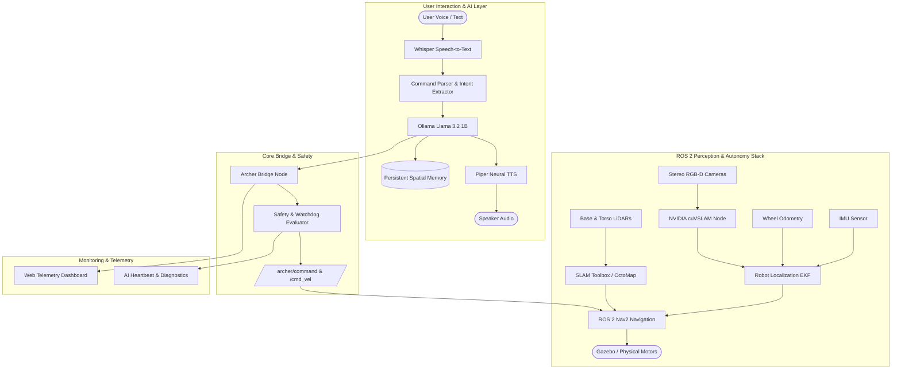

# 🤖 A.R.C.H.E.R. — Advanced Relationship & Command Handling Entity for Robotics

<div align="center">


**An autonomous, voice-interactive humanoid robotics platform integrating zero-cloud local AI, NVIDIA cuVSLAM stereo visual odometry, ROS2 Nav2 spatial planning, and real-time telemetry.**

[Key Capabilities](#-key-capabilities) • [System Specifications](#-system-specifications) • [Architecture](#-system-architecture) • [Quick Start](#-quick-start) • [Repository Structure](#-repository-structure)

---

</div>

## 📌 Executive Overview

**A.R.C.H.E.R.** (*Advanced Relationship & Command Handling Entity for Robotics*) bridges the gap between natural human conversation and complex, real-time spatial robotics execution. Designed to operate **100% locally with zero cloud dependencies**, Archer processes continuous voice directives, understands intent via a quantized local LLM, navigates indoor environments autonomously using CUDA-accelerated visual odometry and Nav2, and maintains persistent spatial memory.

> [!NOTE]
> **Status: Completed & Graded**  
> This project has been successfully completed and evaluated as part of advanced robotics coursework.

---

## ⚡ Key Capabilities

- 🗣️ **100% Local Voice & Intelligence Pipeline**: Real-time microphone listening via OpenAI Whisper STT, intent extraction via local Ollama LLM (`llama3.2:1b` / `llama3.1:8b`), and neural voice responses via Piper ONNX TTS.
- 👁️ **GPU-Accelerated Stereo Visual SLAM**: High-frequency feature tracking and odometry (`odom` → `base_link`) using **NVIDIA cuVSLAM (PyCuVSLAM)** operating directly on stereo camera streams.
- 🧭 **Autonomous Spatial Navigation & Mapping**: Dual-layer SLAM (2D Cartographer/SLAM Toolbox + 3D Voxel OctoMap) coupled with ROS2 Nav2 (DWB/Navfn planners) and EKF sensor fusion (wheel odometry + IMU + cuVSLAM).
- 🧠 **Persistent Spatial Memory**: Semantic location DB mapping rooms, coordinates, and object locations to execute context-aware instructions like *"Archer, go to the living room table"*.
- 🛡️ **Fail-Safe Watchdog & Safety Engine**: Multi-tiered motion validation, speed-capping (`max_linear: 2.0 m/s`), and zero-velocity hardware heartbeat watchdog (3.0s timeout).
- 📊 **Real-time Web Dashboard**: Telemetry UI displaying live diagnostics, robot status, AI heartbeats, and video streams.

---

## 🛠️ System Specifications

### 1. Hardware & System Requirements

| Component | Minimum Specification | Recommended Specification |
| :--- | :--- | :--- |
| **OS Environment** | Ubuntu 22.04 LTS / WSL2 (Windows 11) | Ubuntu 24.04 LTS / WSL2 with WSLg |
| **GPU** | NVIDIA GTX 1660 (6GB VRAM, CUDA 11) | NVIDIA RTX 3080 / RTX 4070+ (8GB+ VRAM, CUDA 12) |
| **CPU** | 6 Cores / 12 Threads (x86_64) | 8+ Cores (AMD Ryzen 7 / Intel Core i7) |
| **RAM** | 16 GB DDR4 | 32 GB DDR4/DDR5 |
| **ROS 2 Distribution** | ROS 2 Humble Hawksbill | ROS 2 Jazzy Jalisco |
| **Simulator** | Gazebo Sim (gz-sim 7 / Garden / Harmonic) | Gazebo Sim Harmonic |

---

### 2. AI Subsystem (Voice & LLM)

```
[ Microphonic Audio ] ──> [ Whisper STT ] ──> [ Command Parser ] ──> [ Ollama Llama 3.2 ]
                                                                             │
[ Speaker Output ]   <── [ Piper Neural TTS ] <── [ Response Synthesizer ] <───┘
```

| Subsystem | Model / Technology | Specs & Configuration |
| :--- | :--- | :--- |
| **Speech-to-Text (STT)** | OpenAI Whisper (`base` / `small`) | 16kHz mono audio, silence detection (1.5s), PyTorch local execution. |
| **LLM Reasoning** | Meta Llama 3.2 1B (or Llama 3.1 8B) | Ollama REST API (`http://localhost:11434`), temperature `0.3`, 5m keep-alive. |
| **Text-to-Speech (TTS)** | Piper Neural TTS (`en_US-lessac-medium`) | ONNX runtime, 22.05kHz audio synthesis, zero network latency. |
| **Memory Database** | JSON Vector & Semantic Store | Persistent relational memory (`ai/memory/db/memory.json`) with room/landmark coordinates. |
| **Optional Gateway** | OpenClaw Execution Engine | Async tool execution and complex multi-step task routing. |

---

### 3. Perception, Robotics & Autonomous Navigation

| Module | Implementation | Description / Role |
| :--- | :--- | :--- |
| **Visual SLAM** | **NVIDIA PyCuVSLAM** | Stereo visual odometry (`/archer/camera/left`, `/archer/camera/right`) producing high-rate `odom` → `base_link` transforms. |
| **Sensor Fusion** | `robot_localization` (EKF) | Fuses wheel odometry, IMU sensor data (`/imu`), and cuVSLAM visual odometry. |
| **2D / 3D Mapping** | SLAM Toolbox / OctoMap | Real-time occupancy grid generation & 3D voxel spatial awareness. |
| **Navigation Stack** | ROS 2 Nav2 | DWB Local Planner, Navfn Global Planner, costmap 2D/3D obstacle avoidance. |
| **Sensor Rig** | Dual LiDAR + Stereo RGB-D | Base 360° LiDAR (`/scan`), Torso LiDAR (`/scan_torso`), Stereo camera rig. |
| **Object Recognition** | YOLO Object Detection | Live target tracking and visual semantic label matching. |

---

### 4. Safety & Control Limits

```yaml
safety:
  max_linear: 2.0 m/s       # Capped linear velocity
  max_angular: 3.0 rad/s     # Capped angular velocity
  watchdog_timeout: 3.0s     # Automatic zero-velocity safety stop on signal drop
  require_validation: true   # Strict command schema checking
```

---

## 🏗️ System Architecture



---

## 🚀 Quick Start

### 1. Prerequisites & Environment Setup

Clone the repository and install the Python AI layer dependencies:

```bash
git clone https://github.com/Aditya-1711/archer_ros.git
cd archer_ros
pip install -r requirements.txt
```

Ensure **Ollama** is installed and pull the required model:

```bash
ollama serve
ollama pull llama3.2:1b
```

*(Optional)* Install **PyCuVSLAM** wheel for GPU-accelerated stereo visual odometry:
Download the matching wheel from [NVIDIA Isaac cuVSLAM Releases](https://github.com/nvidia-isaac/cuVSLAM/releases) and install:
```bash
pip install cuvslam-*-cp312-*-linux_x86_64.whl
```

---

### 2. Launch Simulation & ROS 2 Navigation

Build and source the ROS 2 workspace (Ubuntu / WSL2):

```bash
cd ros2_ws
colcon build --symlink-install
source install/setup.bash
```

Launch Gazebo Sim with Archer humanoid model, Nav2, and cuVSLAM enabled:

```bash
ros2 launch archer_description sim.launch.py use_nav2:=true use_cuvslam:=true
```

---

### 3. Start Archer AI Core System

In a separate terminal, launch the main AI orchestrator:

```bash
python core/main.py
```

Now you can speak or send commands such as:
- 🗣️ *"Archer, move forward 2 meters."*
- 🗣️ *"Archer, navigate to the kitchen."*
- 🗣️ *"Archer, turn left 90 degrees."*

---

## 📂 Repository Structure

```
archer_ros/
├── ai/                         # AI & Natural Language Subsystem
│   ├── llm/                    # Ollama client wrapper & system prompts
│   ├── memory/                 # Spatial location & semantic memory DB
│   ├── parser/                 # Intent extractor & action parser
│   ├── stt/                    # OpenAI Whisper microphone pipeline
│   └── tts/                    # Piper Neural TTS generator
├── config/                     # Central system configuration
│   └── settings.yaml           # Parameters, safety limits, model choices
├── core/                       # Main runtime loop & orchestration
│   └── main.py                 # Core supervisor process
├── dashboard/                  # Web telemetry & live diagnostic frontend
├── ros2_ws/                    # ROS 2 Workspace
│   └── src/
│       ├── archer_bridge/      # ROS 2 <-> AI communication & cuVSLAM nodes
│       │   ├── archer_bridge/
│       │   │   ├── bridge_node.py    # Command topic subscriber
│       │   │   ├── watchdog_node.py  # Safety velocity watchdog
│       │   │   └── cuvslam_node.py   # NVIDIA PyCuVSLAM VO wrapper
│       └── archer_description/ # Robot URDF/Xacro, Gazebo simulation & configs
│           ├── config/          # EKF, Nav2, and visual SLAM parameters
│           ├── launch/          # Gazebo sim launch scripts (`sim.launch.py`)
│           ├── urdf/            # Archer humanoid model definitions
│           └── worlds/          # Gazebo indoor simulation worlds
└── simulation/                 # Runtime JSON state & telemetry exchange
```

---

## 📄 License & Coursework Attribution

Developed and maintained by **[Aditya](https://github.com/Aditya-1711)** as a comprehensive capstone integration of Autonomous Systems, Embedded AI, and GPU-Accelerated Robotics.

Released under the **MIT License**.
